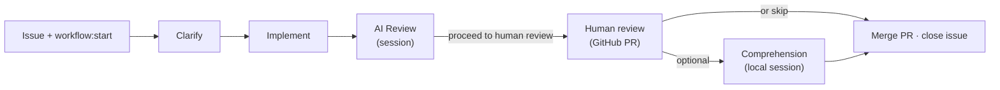

# AI Workflow Routines

[](https://skills.sh/b/D-Andreev/ai-workflow-routines)

GitHub-issue-driven development workflow powered by [Claude Code Routines](https://code.claude.com/docs/en/skills). Adapted from [ai-workflow](https://github.com/D-Andreev/ai-workflow).

## How it works



1. **Clarify** — session Q&A → handoff comment → `workflow:implement`
2. **Implement** — branch, TDD, **draft PR** → `workflow:review` (label swap last)
3. **AI Review** — fresh-eyes diff review in session; user can request fixes on branch until **`proceed to human review`** → `workflow:human-review` (label swap last)
4. **Human review** — checkout branch locally, test/preview; optional **`/workflow-comprehension`**; mark PR ready (`gh pr ready`) when inviting reviewers; merge when satisfied
5. **Comprehension** *(optional, local)* — checkout `work_branch`, test/preview, run **`/workflow-comprehension`** in a local Claude Code session; or skip straight to merge
6. **Done** — merge PR, close issue

## Install

From your **target project** (not this repo):

```bash
INSTALL_INTERNAL_SKILLS=1 npx skills add D-Andreev/ai-workflow-routines --copy --skill '*' -a claude-code -y
/workflow-init
```

Workflow files (`PROJECT.md`, etc.) live under **`.claude/workflows/`** — separate from skills. Commit that directory to git; it is not managed by the skills CLI.

## Update skills

After pushing changes to GitHub, from the **target project**:

```bash
INSTALL_INTERNAL_SKILLS=1 npx skills add D-Andreev/ai-workflow-routines --copy --skill '*' -a claude-code -y
```

Global install: add `-g` to the `skills add` command above (skills land in `~/.claude/skills/`).

Start a **new Claude Code session** after updating.

### If skills disappeared after `skills update`

Re-run the install command above.

If `.claude/skills/` is missing but `.agents/skills/` has your skills, symlink (from project root):

```bash
mkdir -p .claude/skills
for skill in .agents/skills/*/; do
  name=$(basename "$skill")
  ln -sf "../../.agents/skills/$name" ".claude/skills/$name"
done
```

Or use `--copy` via `skills add` to populate `.claude/skills/` directly.

Verify: `npx skills list -a claude-code` and check `.claude/skills/workflow-clarify/SKILL.md` exists.

**Local development** (before push): re-run `skills add` with a local path — `skills update` does not track local installs:

```bash
INSTALL_INTERNAL_SKILLS=1 npx skills add /path/to/ai-workflow-routines --copy --skill '*' -a claude-code -y
```

## Labels

| Label | Triggers |
|-------|----------|
| `workflow:start` | Clarify routine |
| `workflow:clarify` | Clarify in progress |
| `workflow:implement` | Implement routine |
| `workflow:review` | AI Review routine |
| `workflow:human-review` | Human PR review (no routine) |

## Routines

| Routine | Label | Prompt |
|---------|-------|--------|
| Clarify | `workflow:start` | [routines/clarify-routine.md](routines/clarify-routine.md) |
| Implement | `workflow:implement` | [routines/implement-routine.md](routines/implement-routine.md) |
| AI Review | `workflow:review` | [routines/review-routine.md](routines/review-routine.md) |

Handoff format: [skills/workflow-routines/handoff-format.md](skills/workflow-routines/handoff-format.md)

## Skills

| Skill | Scope |
|-------|-------|
| `workflow-init` | Repo setup |
| `workflow-clarify` | Requirements; handoff at approve |
| `workflow-implement` | Code on branch; PR |
| `workflow-review` | AI review + fix loop; handoff at proceed |
| `workflow-comprehension` | Optional local interview before merge (no routine) |

## Session commands

| Phase | Advance |
|-------|---------|
| Clarify | `approve requirements` |
| AI Review | `proceed to human review` (alias: `approve review`) |
| Comprehension (local) | Pass naturally, or `skip-comprehension`; then merge PR and close issue |

### Optional comprehension (local)

After AI review sets `workflow:human-review`:

1. Checkout the PR branch locally (`workflow/issue-{n}` from the issue handoff).
2. Run tests and preview the change (PR stays **draft** — teammates are not asked to review yet).
3. In a **local** Claude Code session: **`/workflow-comprehension`** (optionally `issue #42`).
4. When ready for human reviewers: **`gh pr ready`** (or mark ready in GitHub UI), then merge when satisfied.

No routine, no label change, no handoff update. To skip comprehension: test locally if you want, **`gh pr ready`**, merge, close issue.
