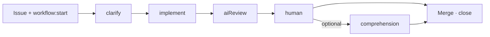

# AI Workflow Routines

[](https://skills.sh/b/D-Andreev/ai-workflow-routines)

Turn GitHub issues into shipped code. An improved [ai-workflow](https://github.com/D-Andreev/ai-workflow) that runs in the cloud via [Claude Code Routines](https://code.claude.com/docs/en/routines) — add a label, a routine starts, you interact from your phone, browser or local claude code.

## How it works



| Phase | What the AI does | What you do |
|-------|------------------|-------------|
| **Clarify** | Asks questions, writes requirements | Answer in the session. Say **`approve requirements`** when done |
| **Implement** | Creates branch, writes code, opens **draft PR** | Wait, or watch in the session |
| **AI Review** | Reviews the diff; posts **one** PR comment with verdict | Nothing — read the PR comment and full report on `workflow/state` |
| **Human review** | — | If REQUEST CHANGES: fix and re-run review. Else: test locally, **`gh pr ready`**, merge |
| **Comprehension** *(optional)* | Asks questions to verify you understand the changes | Answer in a local session (`/workflow-comprehension`); confirm when you're satisfied — or skip by merging |
| **Done** | — | Merge PR, close issue |

Labels advance automatically (`workflow:start` → `workflow:clarify` → `workflow:implement` → `workflow:review` → `workflow:human-review`). You only add `workflow:start` to begin.

## Setup

One-time, in your **target repo**:

**1. Install skills and init**

```bash
INSTALL_INTERNAL_SKILLS=1 npx skills add D-Andreev/ai-workflow-routines --copy --skill '*' -a claude-code -y
/workflow-init
```

`/workflow-init` creates GitHub labels, scaffolds `workflow/` (commit that folder), and creates the long-lived **`workflow/state`** branch for issue handoffs (never merge it). 

To update skills later, re-run the same install command:

```bash
INSTALL_INTERNAL_SKILLS=1 npx skills add D-Andreev/ai-workflow-routines --copy --skill '*' -a claude-code -y
```
**2. Create routines**

At [claude.ai/code/routines](https://claude.ai/code/routines), create three routines — connect your repo with the [Claude GitHub App](https://github.com/apps/claude) (**required** for issue comments, labels, PR reviews, and git push). Org repos: an admin may need to approve app access.

| Routine | Label trigger | Paste from |
|---------|---------------|------------|
| Clarify | `workflow:start` | [routines/clarify-routine.md](routines/clarify-routine.md) |
| Implement | `workflow:implement` | [routines/implement-routine.md](routines/implement-routine.md) |
| AI Review | `workflow:review` | [routines/review-routine.md](routines/review-routine.md) |

## Use it

1. Open a GitHub issue describing the work
2. Add label **`workflow:start`**
3. Open the session link on the issue and follow the phases above

## Example

See [simple-todo-app](https://github.com/D-Andreev/simple-todo-app) — a repo set up with this workflow. Browse its [issues](https://github.com/D-Andreev/simple-todo-app/issues/24) and PRs to see clarify → implement → review in action.
