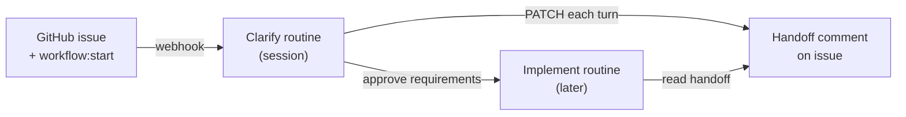

# AI Workflow Routines

[](https://skills.sh/b/D-Andreev/ai-workflow-routines)

GitHub-issue-driven development workflow powered by [Claude Code Routines](https://code.claude.com/docs/en/skills). Adapted from [ai-workflow](https://github.com/D-Andreev/ai-workflow) (Cursor dev-pipeline).

## How it works



1. **Init once** — `PROJECT.md`, `gotchas.md` in the repo.
2. **Open an issue** with `workflow:start` (title + body = task).
3. **Clarify routine** → label `workflow:clarify`, handoff comment + session link, one question at a time.
4. **`approve requirements`** → handoff updated, label `workflow:implement` → implement routine reads handoff comment.

## Install skills

```bash
INSTALL_INTERNAL_SKILLS=1 npx skills add D-Andreev/ai-workflow-routines --copy --skill '*' -a claude-code -y
/workflow-init
```

## GitHub labels

| Label | Purpose |
|-------|---------|
| `workflow:start` | User adds — triggers clarify |
| `workflow:clarify` | Clarify in progress |
| `workflow:implement` | Requirements approved — triggers implement (future) |

One active workflow label per issue. Routines swap atomically.

## State persistence

Routines are **stateless between sessions**. Handoff is on the **GitHub issue**, not in git.

### Repo (committed) — shared project context

| Path | Purpose |
|------|---------|
| `.claude/workflows/PROJECT.md` | Stack, features, `## Language` glossary |
| `.claude/workflows/learnings/gotchas.md` | Pitfalls |
| `docs/adr/` | Decisions from clarify |

### Issue handoff comment — per-issue pipeline

One comment per issue, **edited in place** after each clarify turn. Marker:

```html
<!-- ai-workflow:handoff v1 issue=42 -->
```

Contains fenced sections: `state.json`, `task.md`, `requirements.md` (later phases add more). Full spec: [skills/workflow-routines/handoff-format.md](skills/workflow-routines/handoff-format.md).

The **implement routine** (and clarify resume) loads artifacts by parsing this comment — no repo files under `issues/{n}/`.

### Separate session comment

Human-facing Claude Code session URL — not mixed into the handoff comment.

### Labels

Trigger the next routine; not a data store.

## Routines setup

[claude.ai/code/routines](https://claude.ai/code/routines) + [Claude GitHub App](https://github.com/apps/claude). Clarify prompt: [routines/clarify-routine.md](routines/clarify-routine.md).

## Repo layout

| Path | Purpose |
|------|---------|
| `skills/workflow-init/` | Project setup |
| `skills/workflow-clarify/` | Clarify phase |
| `skills/workflow-routines/` | Handoff format, state schema, labels |
| `routines/` | Routine prompt templates |

## Migrating from ai-workflow (Cursor)

| Cursor | Routines |
|--------|----------|
| Gitignored `artifacts/`, `state.json` | Handoff **issue comment** |
| `/dev-pipeline continue` | New routine reads handoff comment |
| `PROJECT.md` in repo | Same — still committed |

## Skills

| Skill | Purpose |
|-------|---------|
| `workflow-init` | Scaffold durable repo files |
| `workflow-clarify` | Grill; write handoff comment; labels |
