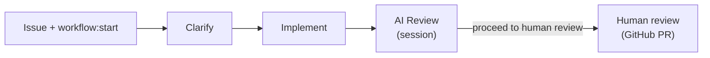

# AI Workflow Routines

[](https://skills.sh/b/D-Andreev/ai-workflow-routines)

GitHub-issue-driven development workflow powered by [Claude Code Routines](https://code.claude.com/docs/en/skills). Adapted from [ai-workflow](https://github.com/D-Andreev/ai-workflow).

## How it works



1. **Clarify** — session Q&A → handoff comment → `workflow:implement`
2. **Implement** — branch, TDD, PR → `workflow:review`
3. **AI Review** — fresh-eyes diff review in session; user can request fixes on branch until **`proceed to human review`** → `workflow:human-review`
4. **Human review** — review and merge PR on GitHub (no routine)

## Install

From your **target project**:

```bash
INSTALL_INTERNAL_SKILLS=1 npx skills add D-Andreev/ai-workflow-routines --copy --skill '*' -a claude-code -y
/workflow-init
```

## Update skills

After pushing to GitHub, from the target project:

```bash
npx skills update -y
```

Re-run the install command or use `-g` for global installs. Start a **new Claude Code session** after updating.

## Labels

| Label | Triggers |
|-------|----------|
| `workflow:start` | Clarify routine |
| `workflow:clarify` | Clarify in progress |
| `workflow:implement` | Implement routine |
| `workflow:review` | AI Review routine |
| `workflow:human-review` | Human PR review (no routine) |

## Routines

| Routine | Label | Prompt |
|---------|-------|--------|
| Clarify | `workflow:start` | [routines/clarify-routine.md](routines/clarify-routine.md) |
| Implement | `workflow:implement` | [routines/implement-routine.md](routines/implement-routine.md) |
| AI Review | `workflow:review` | [routines/review-routine.md](routines/review-routine.md) |

Handoff format: [skills/workflow-routines/handoff-format.md](skills/workflow-routines/handoff-format.md)

## Skills

| Skill | Scope |
|-------|-------|
| `workflow-init` | Repo setup |
| `workflow-clarify` | Requirements; handoff at approve |
| `workflow-implement` | Code on branch; PR |
| `workflow-review` | AI review + fix loop; handoff at proceed |

## Session commands

| Phase | Advance |
|-------|---------|
| Clarify | `approve requirements` |
| AI Review | `proceed to human review` (alias: `approve review`) |
